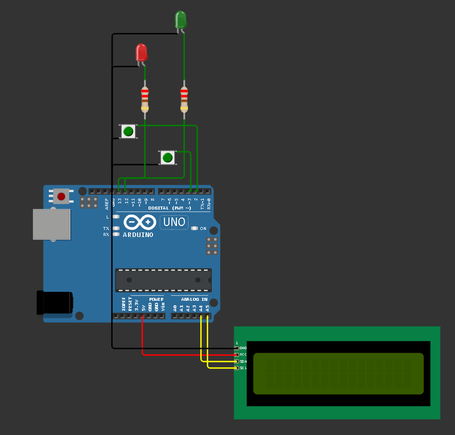
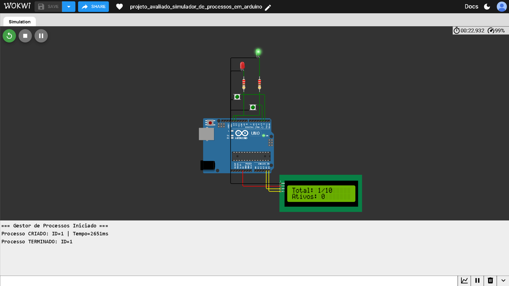
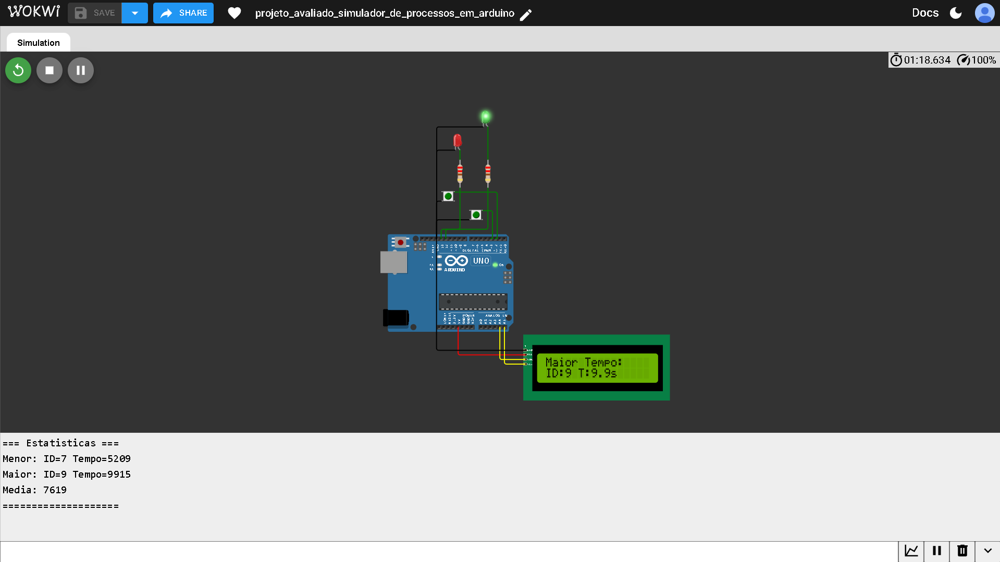
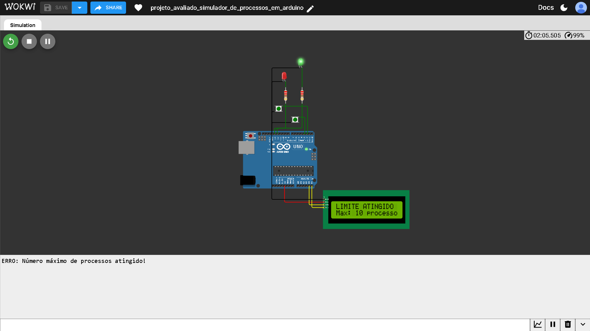

<h1 align="center"> Simulador de Processos — Arduino UNO</h1>

<p align="center">
  <!-- Linguagem / Plataforma -->
  
  
  
  
  
  
  
  
</p>

## Descrição

Projeto embarcado desenvolvido para o Arduino UNO que simula a criação e execução concorrente de processos, exibindo informações em tempo real em um display LCD 16×2 via I2C. O sistema é totalmente não bloqueante: nenhum `delay()` é utilizado; toda a temporização é gerenciada por `millis()`.

---

## Objetivo

Demonstrar, em hardware real (ou simulado), conceitos de gerenciamento de processos — como fila FIFO, execução concorrente, estatísticas de tempo e feedback visual — utilizando uma arquitetura baseada em máquina de estados no loop principal do Arduino.

---

## Demonstração em Vídeo

> ▶️ **[Assistir no YouTube](https://www.youtube.com/watch?v=SEU_LINK_AQUI)**

---

## Circuito



---

## Funcionalidades

- Criação de até 10 processos concorrentes com tempo de execução aleatório entre 2 s e 10 s
- Fila de execução seguindo a política FIFO
- Execução totalmente não bloqueante via `millis()`
- Cálculo de estatísticas em tempo real:
  - Total de processos criados
  - Tempo médio de execução
  - Processo com menor tempo de execução
  - Processo com maior tempo de execução
- Display LCD com dois modos:
  - **Normal:** exibe total de processos criados/máximo e quantidade de processos ativos
  - **Estatísticas:** exibe três telas sequenciais com os dados calculados
- Máquina de estados para mensagens temporárias no LCD (sem bloqueio)
- Debouncing por software nos dois botões (250 ms)
- Feedback visual via dois LEDs:
  - **LED vermelho (pino 13):** aceso enquanto há processos em execução
  - **LED verde (pino 12):** aceso quando todos os processos foram concluídos
- Saída de depuração pelo Serial Monitor (9600 baud)

---

## Capturas de Tela

### Inicialização do sistema


### Processo criado


### Processo concluído


### Estatísticas — Total e Média


### Estatísticas — Menor tempo


### Estatísticas — Maior tempo


### Estatísticas — Visão geral


### Limite de processos atingido


---

## Hardware Utilizado

| Componente              | Quantidade | Observação                        |
|-------------------------|------------|-----------------------------------|
| Arduino UNO             | 1          | Microcontrolador principal        |
| LCD 16×2 com módulo I2C | 1          | Endereço I2C: `0x27`             |
| Push button 6 mm        | 2          | Botão verde — com pull-up interno |
| LED vermelho            | 1          | Indicador de processos ativos     |
| LED verde               | 1          | Indicador de conclusão            |
| Resistor 220 Ω          | 2          | Limitadores de corrente dos LEDs  |

### Mapeamento de Pinos

| Pino | Função                                |
|------|---------------------------------------|
| 2    | Botão BTN_CREATE (criar processo)     |
| 3    | Botão BTN_STATS (exibir estatísticas) |
| 12   | LED_ALL_DONE (todos concluídos)       |
| 13   | LED_ACTIVITY (processos ativos)       |
| A4   | SDA — LCD I2C                         |
| A5   | SCL — LCD I2C                         |

---

## Tecnologias Utilizadas

- **Linguagem:** C++ (Arduino)
- **Plataforma:** Arduino UNO (ATmega328P)
- **Bibliotecas:**
  - `Wire.h` — comunicação I2C (nativa do Arduino)
  - `LiquidCrystal_I2C` — controle do display LCD via I2C
- **Simulador:** [Wokwi](https://wokwi.com/projects/455835648963144705)

---

## Estrutura do Projeto

```
simulador_processos_arduino/
│
├── assets/
│   └── media/
│       ├── video/
│       │   └── demo.mp4
│       │
│       └── images/
│           ├── 01_circuito.png
│           ├── 02_inicializacao_sistema.png
│           ├── 03_processo_criado.png
│           ├── 04_processo_concluido.png
│           ├── 05_estatistica_total_e_media.png
│           ├── 06_estatistica_menor_tempo.png
│           ├── 07_estatistica_maior_tempo.png
│           ├── 08_estatistica_geral.png
│           └── 09_limite_atingido.png
│
├── src/
│   └── simulador_de_processos/
│       ├── simulador_de_processos.ino   # Código-fonte principal
│       ├── diagram.json                 # Diagrama de circuito para o Wokwi
│       ├── libraries.txt                # Lista de bibliotecas utilizadas no Wokwi
│       └── wokwi-project.txt            # Referência ao projeto no Wokwi
│
├── .gitignore
├── LICENSE
└── README.md
```

---

## Como Executar

### Simulação (Wokwi)

1. Acesse [https://wokwi.com/projects/455835648963144705](https://wokwi.com/projects/455835648963144705)
2. Clique em **Start Simulation**
3. Interaja com os botões virtuais:
   - **BTN_CREATE (pino 2):** cria um novo processo
   - **BTN_STATS (pino 3):** exibe as estatísticas no LCD

### Hardware Real

**Pré-requisitos:**
- Arduino IDE instalado
- Biblioteca `LiquidCrystal_I2C` instalada via Gerenciador de Bibliotecas

**Instalação da biblioteca:**
1. Abra a Arduino IDE
2. Vá em **Sketch → Incluir Biblioteca → Gerenciar Bibliotecas...**
3. Pesquise por `LiquidCrystal I2C` e instale

**Upload:**
1. Monte o circuito conforme o `diagram.json`
2. Abra `simulador_de_processos.ino` na Arduino IDE
3. Selecione a porta correta em **Ferramentas → Porta**
4. Clique em **Upload**
5. Abra o **Serial Monitor** a 9600 baud para acompanhar os logs

---

## Status do Projeto

**Protótipo funcional** — desenvolvido como projeto avaliado. Não foram identificados arquivos de testes automatizados ou indicações de continuidade de desenvolvimento.

---

## Autores

Andérson Brito